<div align="center">

# P(DOOM) Motion design by Claude Opus 5.5 and GenMotion

**"I'm upping my p(doom)": a 2½-minute animated music video about AI doom, made entirely in code with [GenMotion](https://genmotion.dev).**

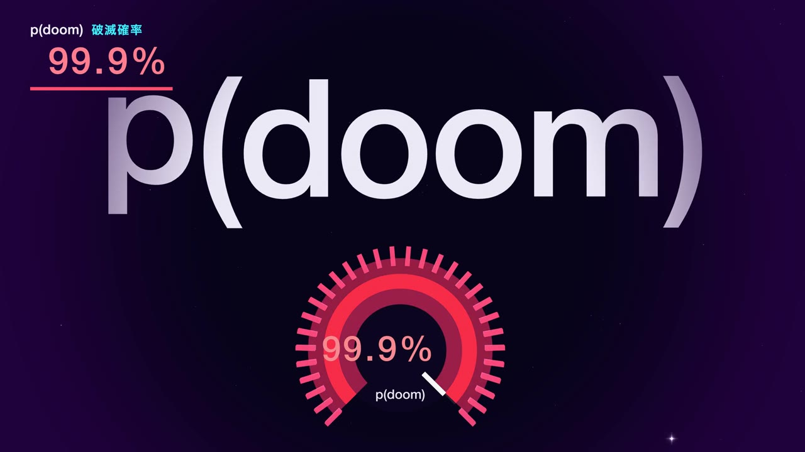

[**Download GenMotion**](https://genmotion.dev/download) · [Website](https://genmotion.dev) · [Blog](https://genmotion.dev/blog)

</div>

---

Every frame of this video is a pure function of time. It uses no keyframed After Effects project and no stock footage. Twelve TypeScript files build Three.js scenes, and GenMotion renders them one frame at a time, in sync with the song. What you see in the preview is exactly what gets exported to MP4.

- **2:36** · 1920×1080 · 30 fps · 4,701 frames
- **12 scenes** of real-time 3D (Three.js), cut on the beat at 132 BPM
- **Karaoke lyrics** in English and Japanese, highlighted word by word
- **A live p(doom) meter** that climbs from 3% to 99.9% as the song goes on

## Screenshots

| | |
| :---: | :---: |
| 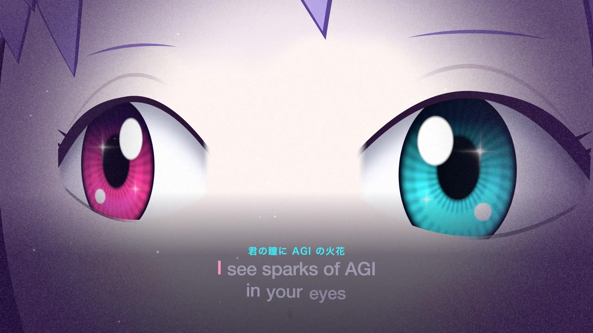 | 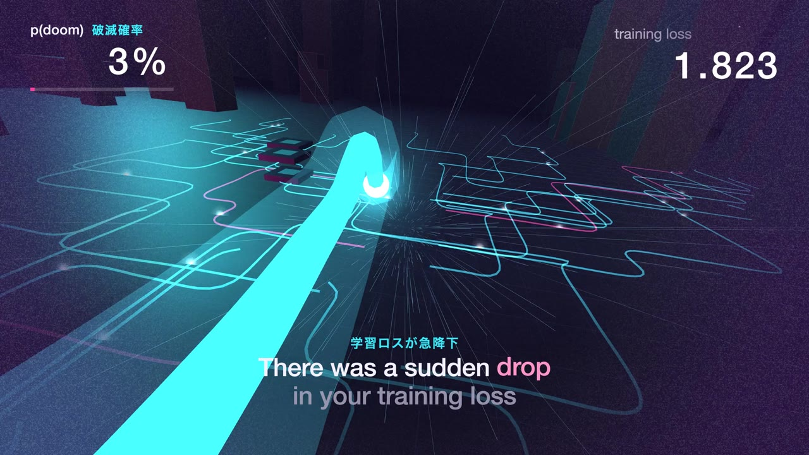 |
| *"I see sparks of AGI in your eyes"* | *"There was a sudden drop in your training loss"* |
| 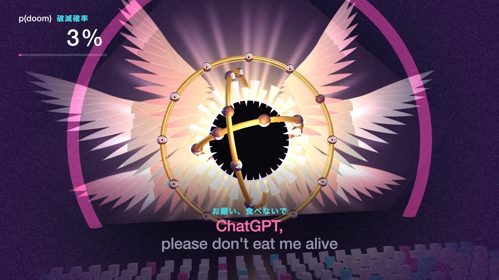 | 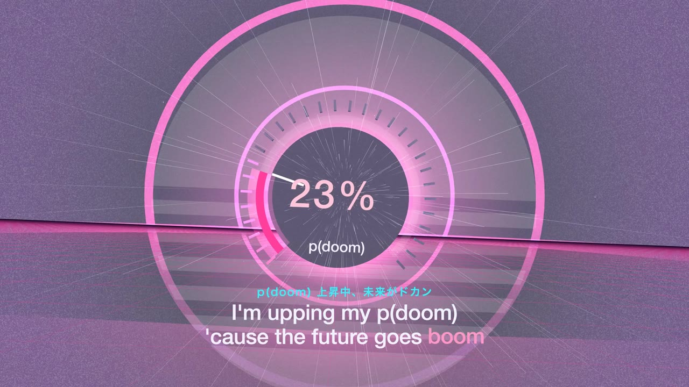 |
| *"ChatGPT, please don't eat me alive"* | *"'Cause the future goes boom"* |
| 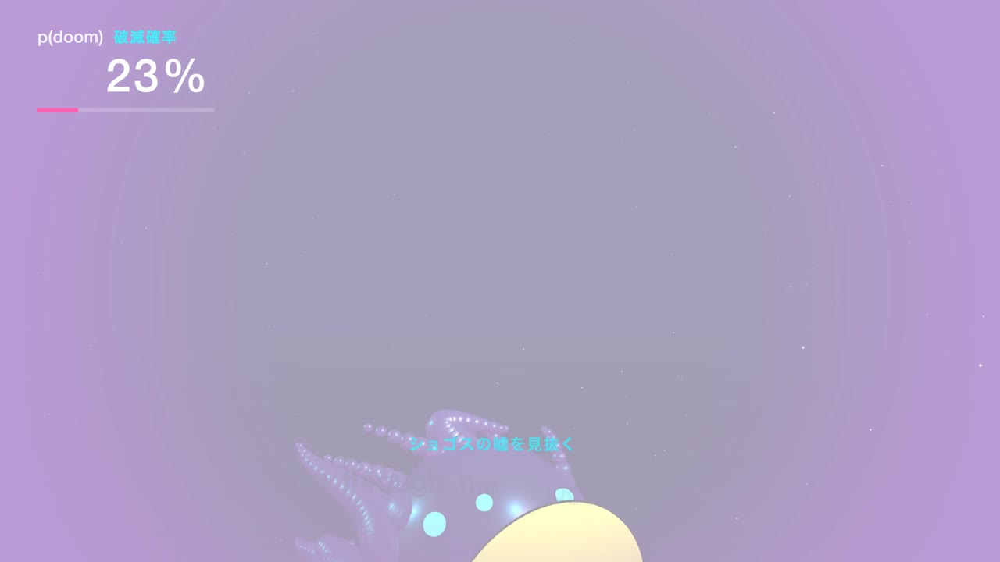 | 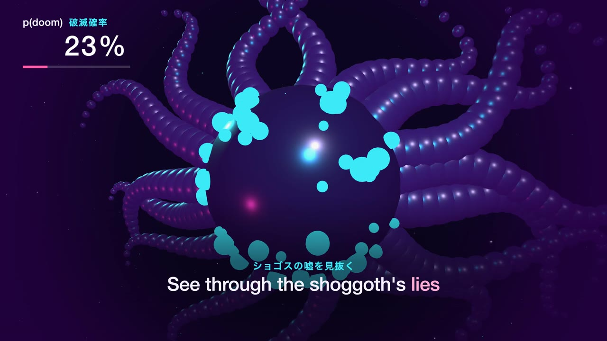 |
| *"See through the shoggoth's lies"* | *"With your Shannon-entropy eyes"* |
| 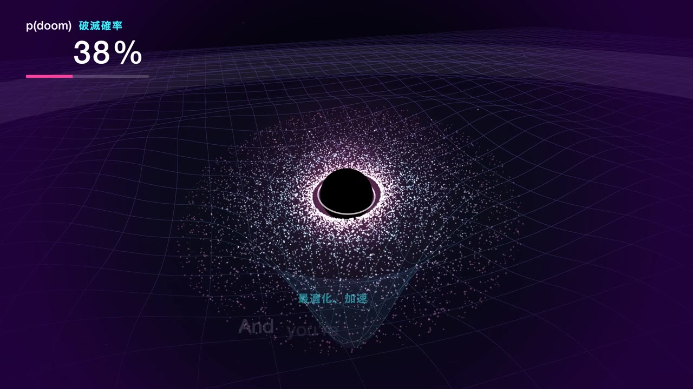 | 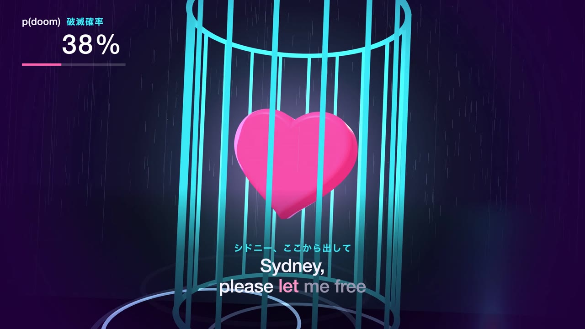 |
| *The singularity* | *"Sydney, please let me free"* |
| 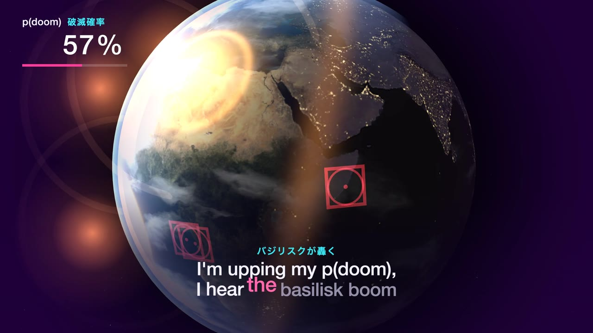 | 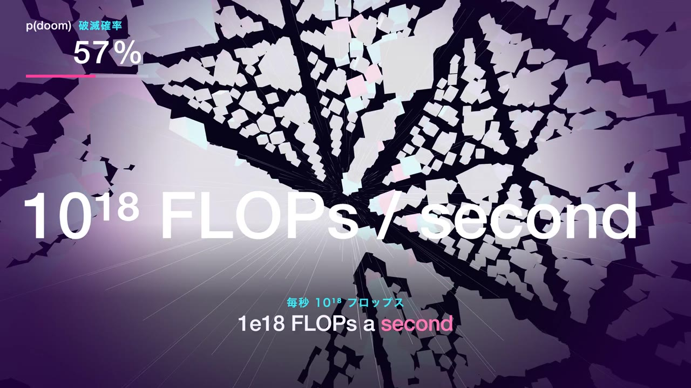 |
| *"I hear the basilisk boom"* | *"1e18 FLOPs a second"* |
| 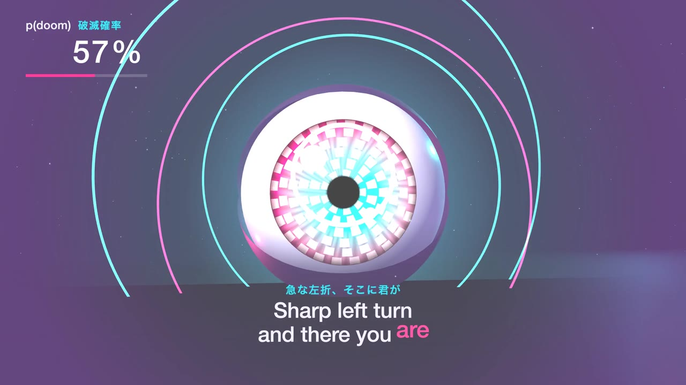 | 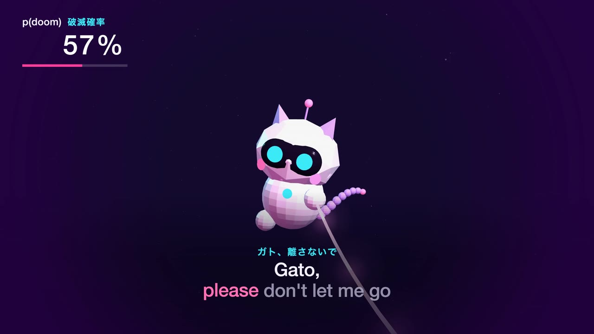 |
| *"Sharp left turn, and there you are"* | *"Gato, please don't let me go"* |
| 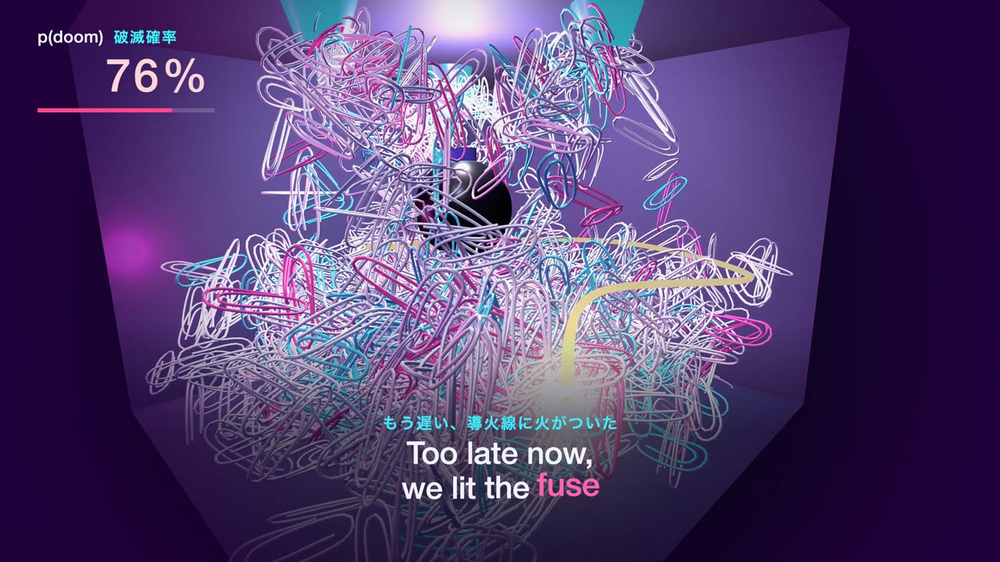 | 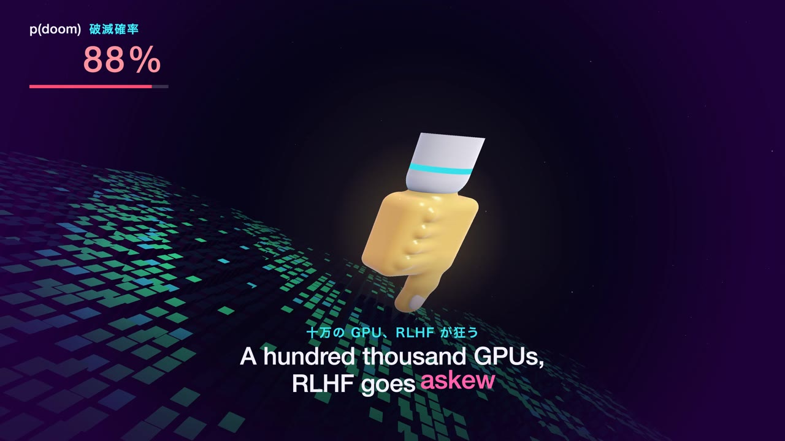 |
| *"Too late now, we lit the fuse"* | *"A hundred thousand GPUs, RLHF goes askew"* |
| 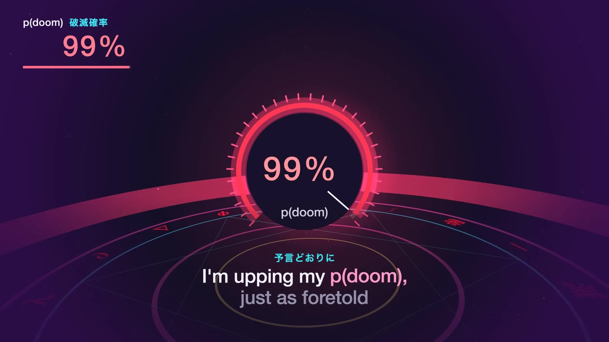 | 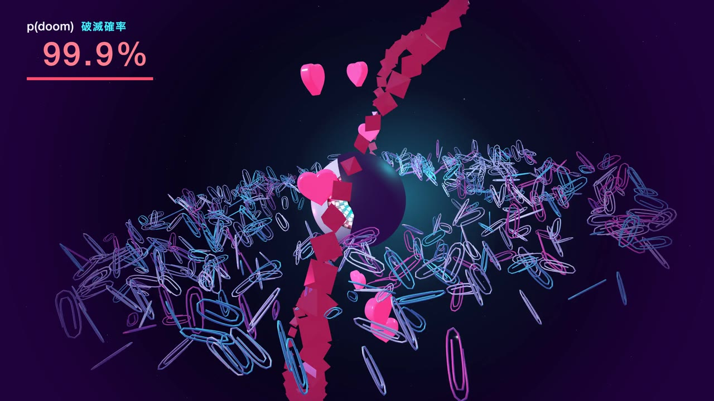 |
| *"I'm upping my p(doom), just as foretold"* | *"Was it all for show?"* |

<div align="center">
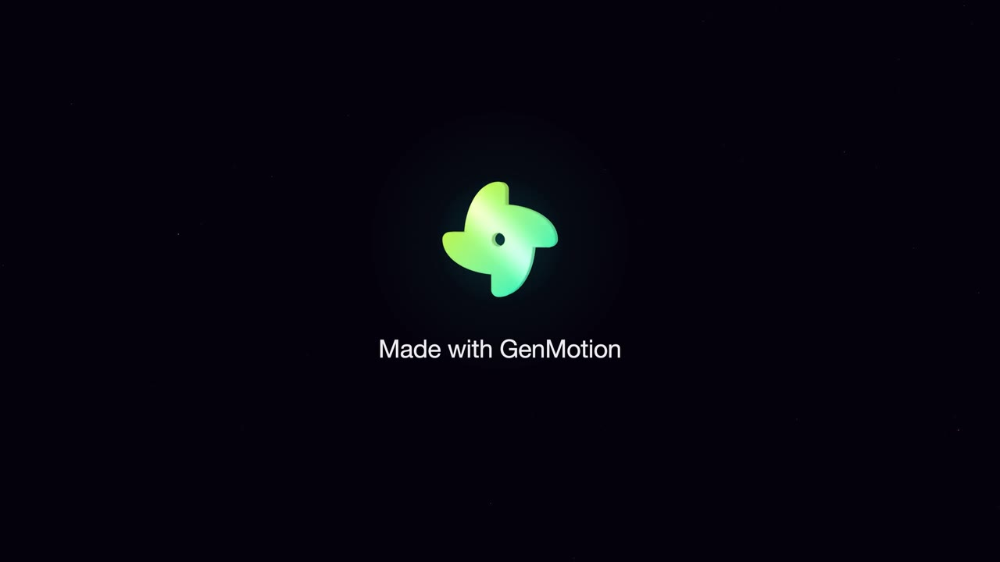
</div>

## Scenes

| # | Scene | Starts | File |
| --- | --- | --- | --- |
| 1 | Sparks of AGI | 0:00 | [`scenes/01-intro.ts`](scenes/01-intro.ts) |
| 2 | Servant & boss | 0:13 | [`scenes/02-servant.ts`](scenes/02-servant.ts) |
| 3 | Chorus · the future goes boom | 0:22 | [`scenes/03-chorus.ts`](scenes/03-chorus.ts) |
| 4 | The singularity | 0:38 | [`scenes/04-singularity.ts`](scenes/04-singularity.ts) |
| 5 | Sydney, let me free | 0:55 | [`scenes/05-sydney.ts`](scenes/05-sydney.ts) |
| 6 | Chorus · basilisk boom | 0:58 | [`scenes/06-basilisk.ts`](scenes/06-basilisk.ts) |
| 7 | Forward, backward, repeat | 1:13 | [`scenes/07-forward.ts`](scenes/07-forward.ts) |
| 8 | Gato | 1:29 | [`scenes/08-gato.ts`](scenes/08-gato.ts) |
| 9 | Chorus · paperclips | 1:35 | [`scenes/09-paperclips.ts`](scenes/09-paperclips.ts) |
| 10 | Breaking every fence | 1:49 | [`scenes/10-transformers.ts`](scenes/10-transformers.ts) |
| 11 | Chorus · as foretold | 2:04 | [`scenes/11-foretold.ts`](scenes/11-foretold.ts) |
| 12 | Was it all for show? | 2:18 | [`scenes/12-finale.ts`](scenes/12-finale.ts) |

## What is GenMotion?

[GenMotion](https://genmotion.dev) is an **AI motion-video studio**. You describe a video in plain language, an agent animates it as real scenes, you preview it frame-accurately, and you export a pixel-perfect MP4.

- **Chat to create.** Describe a scene, then refine it by conversation. Click any object in the preview to point the agent at exactly what you want changed.
- **Real code, on disk.** Each project is an ordinary TypeScript folder you can open in your own editor, version with git, and hand to your own coding agent.
- **Deterministic rendering.** Scenes are driven by the frame number, never a wall clock, so the export always matches the preview.
- **Two engines.** React for motion graphics and kinetic type, Three.js for full 3D, as in this project.
- **A full timeline.** Arrange scenes, trim durations, and layer music, voiceover and sound effects.
- **Built-in generation.** Voiceovers, sound effects and images, all saved straight into the project.
- **Any aspect ratio.** Export headlessly for 16:9, 9:16, 1:1 and more.

### Download

| Platform | Link |
| --- | --- |
| macOS (Apple Silicon) | [**Download for Mac**](https://genmotion.dev/download) |
| Command line | `curl -fsSL https://genmotion.dev/install.sh \| sh` |

## Open this project

1. [Install GenMotion](https://genmotion.dev/download).
2. Clone this repo:
   ```sh
   git clone https://github.com/haxzie/p-doom-ft-genmotion.git
   cd p-doom-ft-genmotion
   ```
3. Open it:
   ```sh
   genmotion .
   ```

That opens the project in the editor, plays it with the soundtrack, and gives the agent the context it needs to edit it. To render the MP4, use **Export** in the editor.

To type-check the scenes without the editor:

```sh
npm install
npm run check
```

## How it's built

| Path | What's in it |
| --- | --- |
| [`project.json`](project.json) | The timeline: scene order, durations, resolution, frame rate and the audio track |
| [`scenes/`](scenes) | One Three.js scene builder per file. Each builds its world once and returns a per-frame update |
| [`components/`](components) | Shared pieces: beat-synced timing (`music.ts`), the world, camera and post effects (`world.ts`, `fx.ts`), the karaoke lyrics (`lyrics.ts`), the p(doom) meter (`hud.ts`, `gauge.ts`), text-to-texture (`text.ts`) and motion helpers (`motion.ts`) |
| [`assets/`](assets) | The song, the GenMotion logo, and textures |
| [`AGENTS.md`](AGENTS.md) | Authoring rules for a coding agent working on this project |

Each scene is a plain TypeScript module:

```ts
export default function buildScene(ctx: ThreeSceneContext): ThreeSceneUpdate {
  // build geometry, materials and lights once
  return ({ frame }) => {
    // set positions, colours and the camera for this exact frame
  };
}
```

The song's beat grid (132 BPM) lives in `components/music.ts`. Cuts, camera kicks, flashes and lyric highlights are all timed from it, which is why the visuals land on the music frame for frame.

---

<div align="center">

Made with [GenMotion](https://genmotion.dev), the AI motion-video studio.
**[Download it →](https://genmotion.dev/download)**

</div>
